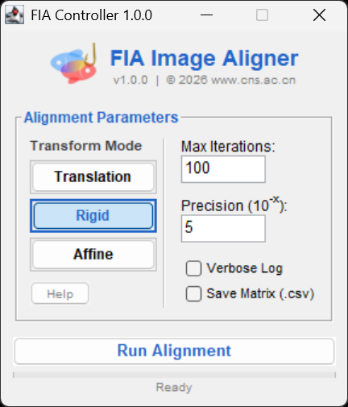

<p align="center">
  
</p>

<h1 align="center">FIA: Fluorescence Image Aligner</h1>

<p align="center">
  
  
  
  
  <br>
  
  
  <a href="https://doi.org/10.5281/zenodo.18206932"></a>
</p>

<p align="center">
  <strong>Robust Motion Correction for Biological Time-Lapse Microscopy</strong>
  <br>
  <em>Specialized for Calcium Imaging (G/R-CaMP), Voltage Imaging, and Long-term Live Cell Monitoring.</em>
</p>

---

<div align="center">


<br>
<em>(FIA corrects both global drift and local tissue deformation)</em></div>

## 📖 Overview

**FIA (Fluorescence Image Aligner) v3.1.0** is a major update designed to solve the full spectrum of motion artifacts in fluorescence microscopy.

Whether you are dealing with sub-pixel jitter in functional imaging or complex tissue deformation in behaving animals, FIA provides a unified solution. It bridges the gap between high-precision rigid alignment and robust non-rigid registration.

### 🚀 What's New in v3.1.0?
* **New "Dense Flow" Engine**: A robust non-rigid registration mode using **Temporal Averaging (Super Reference)** and **CLAHE** pre-processing.
* **Smart UI**: Parameter panels now dynamically adapt to your selected mode.
* **Scientific Validity**: Strict separation of alignment calculation (using enhanced images) and pixel transformation (using raw data).

---

## ✨ Key Features

### 1. Dual-Engine Core
* **OpenCV ECC**: Best for high-precision, sub-pixel rigid alignment (Rotation/Translation).
* **Dense Flow (New Standard)**: State-of-the-art local deformation correction. Handles internal tissue warping better than any rigid method.
* **Legacy Mode**: A fallback engine based on Kang Li's "Image Stabilizer" for systems without OpenCV support.

### 2. Scientific Integrity
* **Intensity Preservation**: FIA guarantees that your **ΔF/F** analysis remains valid.
    * *Navigation:* Motion vectors are calculated using noise-reduced, contrast-enhanced temporary frames.
    * *Transport:* These vectors are applied to your **original raw data** using cubic interpolation.
    * **Result:** No artificial contrast or brightness is written to your final image.

### 3. Smart "Super Reference"
* In **Dense Flow** mode, FIA creates a reference anchor by averaging `N` frames (user-definable). This eliminates the "floating anchor" problem caused by shot noise in single-frame references.

---

## 📥 Installation

1.  Download the latest `FIA-3.1.0.jar` from the [Releases Page](../../releases).
2.  Drag and drop the file into your Fiji/ImageJ **`plugins`** folder (or main window).
3.  Restart Fiji.
4.  Navigate to: `Plugins > Biosensor Tool > FIA Image Aligner`.

---

## 🎮 Usage Guide

### 1. Engine Selection

| Mode | Description | Best For |
| :--- | :--- | :--- |
| **Global (Step 1)** | **Translation / Rigid / Affine** | Corrects general XY drift and Rotation. (Recommended for behaving animals). |
| **Dense Flow (Step 2)** | **(Recommended)** Uses Super Reference + CLAHE. | **95% of Biological Samples.** Noisy fluorescence, brain slices, in vivo imaging. |
| **Elastic (Step 2)** | (Legacy) Raw optical flow without preprocessing. | **High-SNR Data.** Binary masks, artificial beads, or clean data where contrast enhancement is harmful. |

### 2. Controller Settings

<div align="center">
  
  <br><em>(The new Smart UI in v3.1.0 adapts to your selected mode)</em>
</div>

* **Global Settings (Hidden in Local Mode)**:
    * **Max Iterations**: Loop limit for Rigid/Affine calculation.
    * **Precision**: Convergence threshold ($10^{-x}$).

* **Dense Flow Settings (New)**:
    * **Flow WinSize**: The "field of view" for local alignment.
        * *Small (5)*: Captures fine jitter.
        * *Large (15+)*: Captures global tissue waves.
    * **Ref Depth**: Number of frames averaged to create the "Super Reference". (Default: 5).
    * **Poly N**: Smoothing factor. *5 (Sharp)* vs *7 (Blur/Noisy)*.

---

## 📚 Algorithm References

FIA is built upon the following established computer vision algorithms:

**1. Non-Rigid Registration (Dense Flow)**
* **Farnebäck, G. (2003).** Two-Frame Motion Estimation Based on Polynomial Expansion. *SCIA 2003*.
* **Zuiderveld, K. (1994).** Contrast Limited Adaptive Histogram Equalization (CLAHE). *Graphics Gems IV*.

**2. Rigid / Affine Alignment (ECC)**
* **Evangelidis, G. D., & Psarakis, E. Z. (2008).** Parametric Image Alignment using Enhanced Correlation Coefficient Maximization. *IEEE TPAMI*.

**3. Legacy Stabilization**
* **Li, K. (2008).** The Image Stabilizer Plugin for ImageJ.
* **Lucas, B. D., & Kanade, T. (1981).** An Iterative Image Registration Technique with an Application to Stereo Vision. *IJCAI*.

---

## 📚 Citation

If you use FIA in your research, please cite:

```bibtex
@software{wang_fia_2026,
  author = {Wang, Kui},
  title = {FIA: Fluorescence Image Aligner - Robust Motion Correction for ImageJ/Fiji},
  version = {v3.1.0},
  year = {2026},
  url = {[https://github.com/Epivitae/FIA-Fluorescence-Image-Aligner](https://github.com/Epivitae/FIA-Fluorescence-Image-Aligner)},
  doi = {10.5281/zenodo.18206932}
}
```

---

<p align="center">
  <strong>© 2026 Dr. Kui Wang | Chimeric Nano Sensor Team | www.cns.ac.cn</strong>
</p>